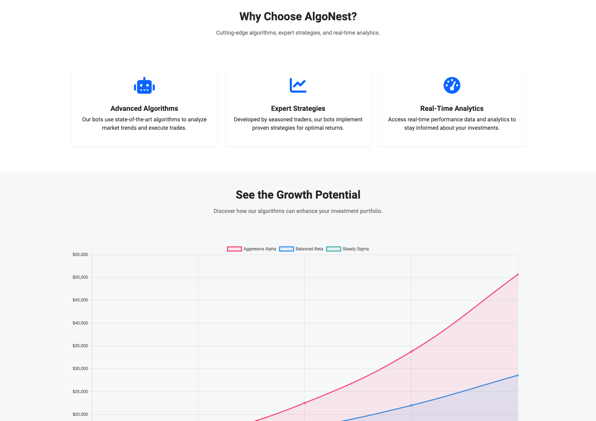
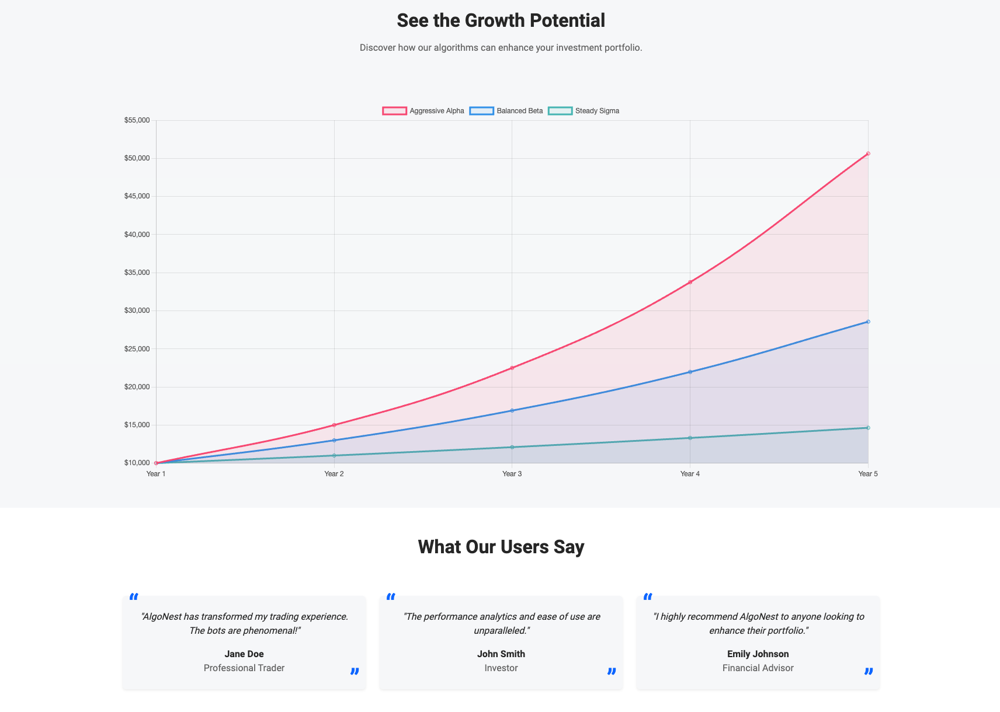
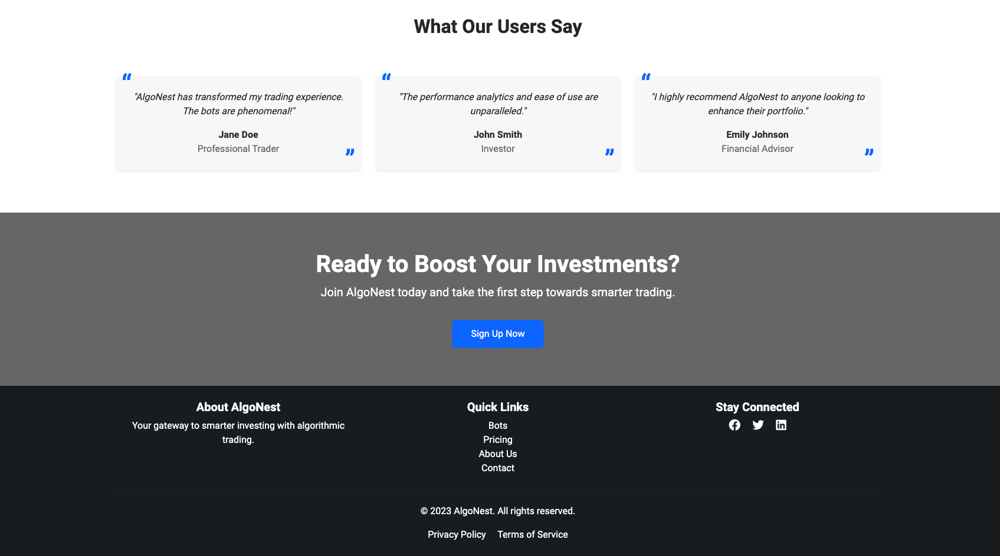
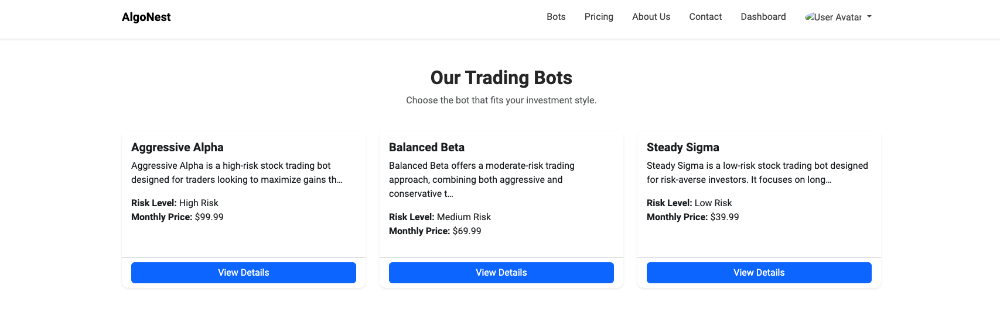
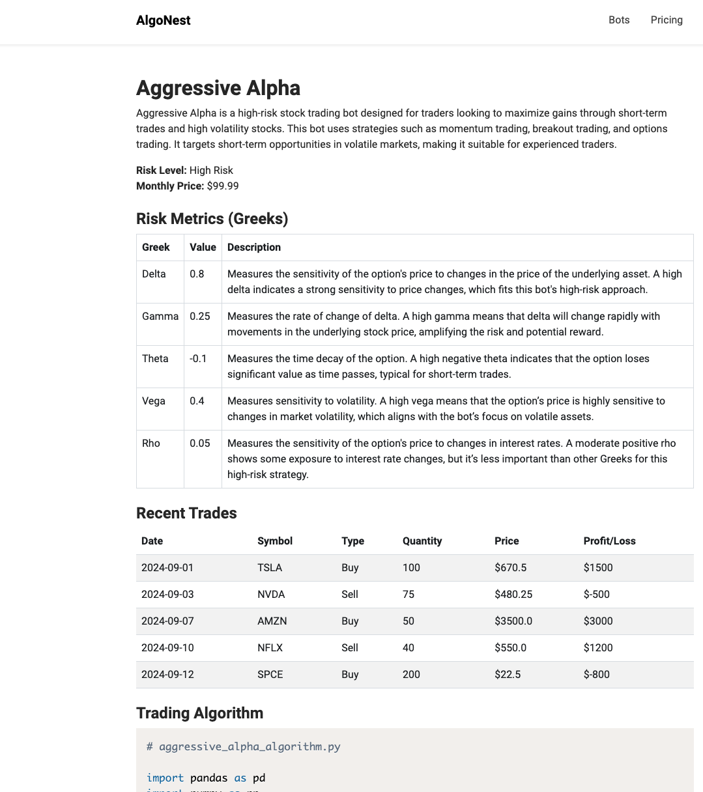
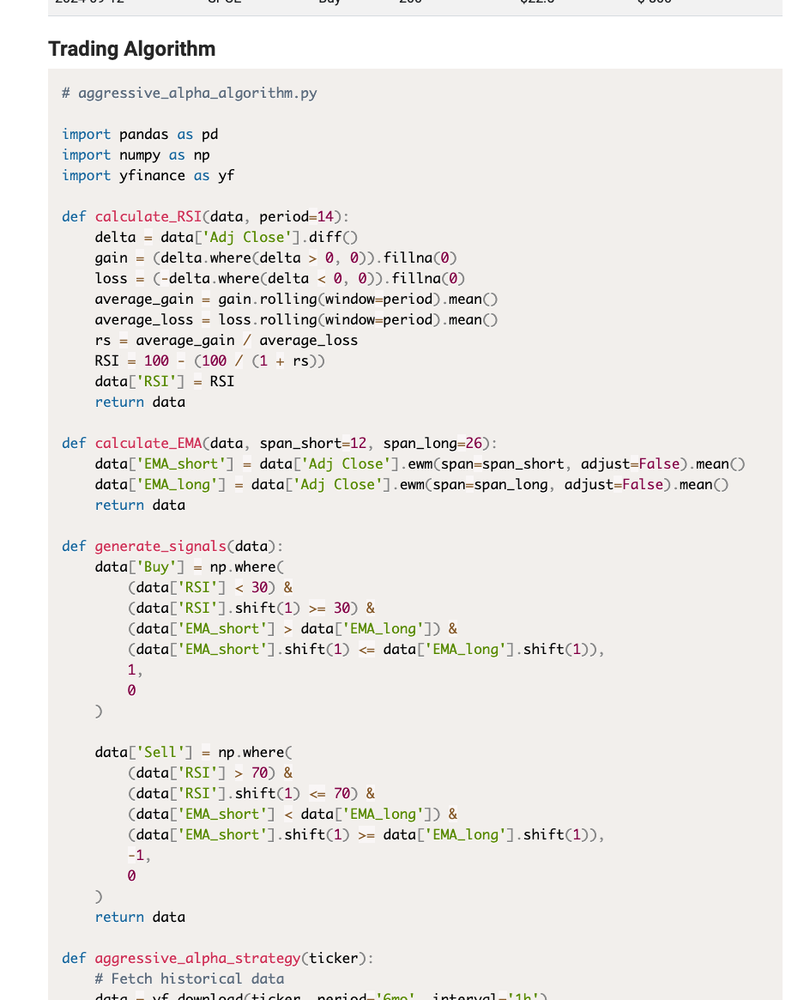

<div align="center">

# Project Collection

**A portfolio of software engineering projects spanning machine learning, full-stack development, systems programming, data visualization, and mobile development.**

[]()
[]()
[]()
[]()
[]()
[]()
[]()
[]()
[]()
[]()
[]()
[]()

</div>

---

## Table of Contents

| # | Project | Domain | Technologies |
|:-:|---------|--------|-------------|
| 1 | [PropAI](#1--propai) | Sports Analytics / ML | Python, Flask, SQLite, Statistical Modeling |
| 2 | [Deep Learning LOINC Standardization](#2--deep-learning-loinc-standardization) | Healthcare ML / NLP | TensorFlow, Sentence-T5, Contrastive Learning |
| 3 | [NBA Three-Point Revolution Dashboard](#3--nba-three-point-revolution-dashboard) | Data Visualization | D3.js, JavaScript, GitHub Pages |
| 4 | [Database Management System](#4--database-management-system) | Systems Engineering | Python, pyparsing, B-Tree, ACID |
| 5 | [Job Application Dashboard](#5--job-application-dashboard) | Desktop Application | Python, PyQt6, SQLite, Matplotlib |
| 6 | [Flight Route Analysis Tool](#6--flight-route-analysis-tool) | Graph Algorithms | C++, BFS, Dijkstra, PageRank |
| 7 | [Havyn](#7--havyn) | iOS Mobile App | Swift, SwiftUI, SwiftData |
| 8 | [AlgoNest](#8--algonest) | Full-Stack Web | Django, Bootstrap 5, Chart.js |
| 9 | [LA Crime Statistics Web App](#9--la-crime-statistics-web-app) | Full-Stack Web | React, TypeScript, Node.js, MySQL |
| 10 | [AI Article Summarizer](#10--ai-article-summarizer) | NLP / AI | Flask, HuggingFace Transformers, NLTK |
| 11 | [School Scheduler](#11--school-scheduler) | Desktop Application | Python, Tkinter, SQLite, Matplotlib |
| 12 | [TicTacToeAI](#12--tictactoeai) | Game AI | Python, Tkinter, Minimax Algorithm |

---

## 1 · PropAI

> A fully local NBA player prop betting analysis platform — ingests box scores, projects player stats using a multi-model statistical engine, calculates edges against sportsbook lines, and recommends high-value bets. Zero cloud dependency.

<table>
<tr><td><b>Stack</b></td><td>Python &middot; Flask &middot; SQLite &middot; Statistical Modeling &middot; CLI</td></tr>
</table>

<p align="center">
  
</p>

<details>
<summary><b>More Screenshots</b></summary>
<p align="center">
  
  <br/><br/>
  
  <br/><br/>
  
  <br/><br/>
  
  <br/><br/>
  
  <br/><br/>
  
</p>
</details>

<details>
<summary><b>Architecture</b></summary>

```
PropAI/
├── src/nba_props/
│   ├── engine/            # Projection engine, edge calculator, matchup models,
│   │   │                  # regression, model registry, backtesting framework
│   │   ├── projector.py           # Weighted stat projections with recency bias
│   │   ├── edge_calculator.py     # Normal distribution CDF edge computation
│   │   ├── matchup_advisor.py     # Opponent-adjusted contextual analysis
│   │   ├── regression_models.py   # Multi-model regression framework
│   │   ├── model_registry.py      # Model version management (v9–v19)
│   │   └── usage_redistribution.py
│   ├── ingest/            # ESPN box score parser, odds API client, injury reports
│   ├── web/               # Flask GUI with 16+ templates
│   │   ├── app.py                 # 95+ routes (17 pages + 78 API endpoints)
│   │   └── templates/             # Dashboard, projections, model lab, docs, etc.
│   ├── cli.py             # 20+ CLI subcommands
│   └── db.py              # SQLite data layer with 20+ tables
├── scripts/               # Backtesting & model evaluation
├── run_cli.py             # Entry point (defaults to web GUI)
└── pyproject.toml
```

</details>

#### Key Features

- **Multi-Model Prediction Engine** — 19 iterative model versions (v9–v19) with walk-forward validation and documented backtest results achieving a **66.7% hit rate** across 348 verified picks
- **Dual-Model Architecture** — Separate General model and specialized Under model with a multi-model picker that selects the best performer per context
- **Player Archetype System** — Database-backed classification with ~200 player profiles across 6 tiers (MVP candidates to rotation pieces) and offensive/defensive roles (Point Centers, Stretch Fives, 3-and-D Wings, Rim Runners, etc.)
- **Matchup Advisor** — Opponent-adjusted projections factoring team defense ratings, elite defender tracking, position-based matchup analysis, and hot/cold streak detection
- **Fatigue & Context Modeling** — Back-to-back detection, rest advantage boosts, usage redistribution when key players are injured, and tank/trade deadline detection
- **Edge Calculator** — Normal distribution CDF probability computation, American odds conversion, and expected value calculation
- **Full Web GUI** — Flask-powered dashboard with paste-based box score ingestion, projection views, model lab, backtest visualization, and a comprehensive documentation section
- **Comprehensive CLI** — 20+ argparse subcommands for data ingestion, projections, archetype management, and team analysis
- **Live Odds Integration** — The Odds API client for fetching real-time sportsbook lines

<details>
<summary><b>Technical Details</b></summary>

| Component | Implementation |
|-----------|---------------|
| Projection Engine | Weighted average of L5/L20/Season stats with configurable weights, recency bias, and context adjustments |
| Edge Calculation | Normal distribution CDF via `math.erf` — computes over/under probabilities against implied odds |
| Matchup Analysis | Position-based defense ratings, player-vs-team historical splits, archetype-aware adjustments, dampened factors (capped ±15%) |
| Confidence Scoring | Star rating system (1–5 stars) calibrated to model-specific thresholds |
| Data Ingestion | Smart parser handling raw ESPN box scores, markdown tables, CSV, with auto-detection of teams, positions, injuries |
| Database | SQLite with 20+ normalized tables — games, box scores, lines, archetypes, defense ratings, salaries, trends |
| Core Dependencies | **Zero** for CLI (stdlib only) — Flask is the only optional dependency |

</details>

---

## 2 · Deep Learning LOINC Standardization

> A deep learning system for automatic standardization of laboratory test descriptions to LOINC codes using contrastive learning with a Sentence-T5 encoder. Achieves **94% Top-5 accuracy** on standard target pools. Includes a contribution to the PyHealth healthcare ML framework.

<table>
<tr><td><b>Stack</b></td><td>TensorFlow &middot; Sentence-T5 &middot; Keras &middot; scikit-learn &middot; pandas &middot; Matplotlib</td></tr>
<tr><td><b>Paper</b></td><td>Reproduces and extends: <em>"Automated LOINC Standardization Using Pre-trained Large Language Models"</em> (Tu et al.)</td></tr>
</table>

<p align="center">
  
</p>

<details>
<summary><b>More Visualizations</b></summary>
<p align="center">
  
  <br/><em>Two-Stage Training Pipeline</em>
  <br/><br/>
  
  <br/><em>Triplet Loss Contrastive Learning</em>
  <br/><br/>
  
  <br/><em>Model Performance — Top-k Accuracy</em>
  <br/><br/>
  
  <br/><em>Data Augmentation Pipeline</em>
  <br/><br/>
  
  <br/><em>Ablation Study — Component Impact</em>
</p>
</details>

<details>
<summary><b>Architecture</b></summary>

```
Deep Learning Loinc Standardization/
├── models/
│   ├── t5_encoder.py          # LOINCEncoder: Frozen ST5-base → projection → L2 norm
│   ├── triplet_loss.py        # Triplet loss with cosine distance
│   ├── triplet_mining.py      # Hard, semi-hard, and scale-aware negative mining
│   ├── train.py               # Two-stage training with GradientTape
│   ├── evaluation.py          # Top-k accuracy, error analysis
│   ├── inference.py           # Production inference pipeline
│   └── ablation_study.py      # Component ablation analysis
├── preprocessing/             # Text normalization, tokenization
├── data_augmentation.py       # 4-technique augmentation pipeline
├── no_match_handler.py        # Unmappable test detection
├── PyHealth_Contribution/     # Framework integration for PyHealth
├── images/                    # Architecture diagrams & result visualizations
├── results/                   # Evaluation outputs, PR/ROC curves
└── project report/            # Final research paper (PDF)
```

</details>

#### Key Features

- **Two-Stage Training Pipeline** — Stage 1 optimizes the embedding space using LOINC targets only (~7,800 codes); Stage 2 fine-tunes with MIMIC-III source-target pairs (575 mappings) using 5-fold stratified cross-validation
- **Sentence-T5 Backbone** — Frozen pre-trained ST5-base encoder producing 768-dim embeddings, projected to 128-dim with L2 normalization for cosine similarity retrieval
- **Triplet Loss with Advanced Mining** — Hard negative, semi-hard negative, and scale-aware mining strategies with margin α=0.8
- **Data Augmentation** — Character deletion, word swapping, related-term insertion, and medical acronym substitution (e.g., "hemoglobin" ↔ "hgb")
- **Scale Token Integration** — Appends `##scale=ql##` / `##scale=qn##` tokens to distinguish qualitative vs. quantitative lab tests
- **No-Match Detection** — Identifies unmappable lab tests via similarity thresholding with confidence calibration
- **PyHealth Contribution** — Full integration with the PyHealth healthcare ML framework including custom datasets, models, and task definitions

#### Results

| Evaluation Scenario | Top-1 | Top-3 | Top-5 |
|---|---|---|---|
| Standard Pool | 52.0% ± 2.7% | 81.0% ± 4.2% | **94.0% ± 2.2%** |
| Expanded Pool (2,575 codes) | 51.0% ± 2.2% | 81.0% ± 6.5% | 89.0% ± 2.2% |

---

## 3 · NBA Three-Point Revolution Dashboard

> An interactive narrative visualization exploring the NBA's strategic transformation from mid-range shooting to three-point dominance across 21 seasons (2004–2024), built on analysis of **4.2 million+ shot records**.

<table>
<tr><td><b>Stack</b></td><td>D3.js v7 &middot; JavaScript &middot; HTML5/CSS3 &middot; GitHub Pages</td></tr>
<tr><td><b>Live Demo</b></td><td><a href="https://arnolda2.github.io/Narrative-Visualization/">arnolda2.github.io/Narrative-Visualization</a></td></tr>
</table>

<p align="center">
  
</p>

<details>
<summary><b>Architecture</b></summary>

```
NBA Dashboard Project/
├── index.html                      # Main entry point with scene navigation
├── script.js                       # Core visualization engine (5 scenes)
├── enhanced_explorer.js            # Advanced interactive explorer
├── styles.css                      # Base styles
├── enhanced_explorer.css           # Explorer-specific styles
├── data/
│   ├── scene{1-4}_data.json        # Pre-processed per-scene data
│   ├── enhanced_explorer_data.json # Comprehensive team/player/league data
│   ├── top_shooters.json           # Player-level three-point leaders
│   └── master_three_point_sample.csv
├── process_data.py                 # Season CSV → JSON pipeline
├── process_comprehensive_nba_data.py
└── create_master_dataset.py
```

</details>

#### Key Features

- **5-Scene Interactive Narrative** — Overview → Evolution Timeline → Revolutionary Players → Efficiency Revolution → Interactive Explorer, with guided navigation and contextual annotations
- **Advanced D3.js Charting** — Stacked area charts, multi-line trend visualizations, animated transitions between scenes, annotations via `d3-annotation`, responsive SVGs
- **Full Interactive Explorer** — Team and player comparison tools, time range filtering, conference breakdowns, custom metric selection for deep-dive analysis
- **Data Pipeline** — Python scripts process 21 CSV datasets (4.2M+ shots across all NBA seasons) into optimized JSON for browser rendering
- **Deployed on GitHub Pages** with responsive design

---

## 4 · Database Management System

> A relational database management system built from scratch — SQL parsing, query execution, B-Tree indexing, ACID-compliant transactions, and concurrency control, all with a visual GUI query interface.

<table>
<tr><td><b>Stack</b></td><td>Python &middot; pyparsing &middot; B-Tree &middot; ACID Transactions &middot; PyQt5</td></tr>
</table>

<details>
<summary><b>Architecture</b></summary>

```
                    ┌──────────────┐
                    │   PyQt5 GUI  │
                    └──────┬───────┘
                           │
                    ┌──────▼───────┐
                    │  SQL Parser  │  ← pyparsing grammar
                    │  (pyparsing) │
                    └──────┬───────┘
                           │
                    ┌──────▼───────┐
                    │  Execution   │
                    │   Engine     │
                    └──┬───┬───┬───┘
                       │   │   │
          ┌────────────┘   │   └────────────┐
          │                │                │
   ┌──────▼──────┐ ┌──────▼──────┐ ┌───────▼──────┐
   │   Storage   │ │ Transaction │ │  Concurrency │
   │   Engine    │ │   Manager   │ │   Control    │
   │ (disk I/O)  │ │ (WAL/ACID)  │ │  (locking)   │
   └──────┬──────┘ └─────────────┘ └──────────────┘
          │
   ┌──────▼──────┐
   │  B-Tree     │
   │   Index     │
   └─────────────┘
```

```
database_management_system/
├── main.py               # DBMS orchestrator (SimpleDBMS class)
├── sql_parser.py          # pyparsing grammar — SELECT, INSERT, CREATE, UPDATE, DELETE
├── storage_engine.py      # Schema management, binary serialization
├── index.py               # B-Tree implementation for O(log n) lookups
├── concurrency_control.py # Table-level lock manager
├── transaction_manager.py # BEGIN/COMMIT/ROLLBACK with write-ahead logging
├── gui.py                 # PyQt5 visual SQL interface with tabular results
├── data_storage.py        # Data layer utilities
└── data/                  # Serialized table files (.tbl)
```

</details>

#### Key Features

- **SQL Parser** — pyparsing-based grammar supporting `CREATE TABLE`, `SELECT` (with `WHERE` clauses), `INSERT`, `UPDATE`, `DELETE`, data type validation (INT, VARCHAR, TEXT, FLOAT, BOOL), and primary key constraints
- **ACID Transactions** — `BEGIN`, `COMMIT`, `ROLLBACK` with write-ahead logging for crash recovery, per-transaction UUID tracking
- **Concurrency Control** — Table-level lock manager preventing dirty reads and write conflicts
- **B-Tree Indexing** — Custom B-Tree implementation providing O(log n) query performance on indexed columns
- **Storage Engine** — Binary serialization with pickle-based persistence and page-level buffering
- **PyQt5 GUI** — Visual SQL query interface with tabular results display, query history, and CSV export

> Building a DBMS from scratch demonstrates deep understanding of systems internals — parsing, storage, indexing, concurrency, and recovery — the same foundational building blocks that production databases like PostgreSQL are built upon.

---

## 5 · Job Application Dashboard

> A desktop GUI application for tracking job applications with a modern sidebar-navigation interface, analytics dashboard, smart auto-complete, and real-time filtering. Iteratively refined across 4 major versions.

<table>
<tr><td><b>Stack</b></td><td>Python &middot; PyQt6 &middot; SQLite &middot; Matplotlib &middot; Custom Theming</td></tr>
</table>

<details>
<summary><b>Architecture</b></summary>

```
Job Application Dashboard/
├── main.py                 # Application entry point
├── ui/
│   ├── main_window.py      # Sidebar navigation, stacked views
│   ├── dashboard_view.py   # Status cards & summary
│   ├── applications_view.py
│   ├── analytics_view.py   # Matplotlib charts embedded in PyQt
│   ├── filter_panel.py     # Real-time search & pill filters
│   ├── add_application.py  # Smart auto-complete form
│   └── quick_answers_view.py
├── models/                 # Data models
├── database/               # SQLite persistence layer (db_manager_v2)
├── assets/theme.py         # Design token system
└── utils/                  # Helper utilities
```

</details>

#### Key Features

- **MVC Architecture** — Modular component separation with separate views, models, and database managers
- **Custom Theme System** — Centralized design tokens (colors, fonts, border radius, shadow styles) for a consistent, polished UI
- **Smart Auto-Complete** — Learns from application history, suggests frequently used companies and roles, includes predefined software engineering role picker
- **Analytics Dashboard** — Matplotlib charts embedded in PyQt6 showing status distributions, success rates, and trends over time
- **Card-Based Filter Panel** — Pill buttons for time ranges, real-time search, status dropdown filters that auto-apply as you type
- **macOS Desktop Launcher** — Packaged with AppleScript-based `.app` bundle and shell script launchers

#### Version History

| Version | Key Change |
|---------|-----------|
| v1 — Job Application Tracker | PyQt5 base app with core tracking features |
| v2 | Added launcher scripts and desktop integration |
| v3 — Dashboard v3 | UI polish and incremental improvements |
| **v4 — Job Application Dashboard** | **PyQt6 upgrade, Quick Answers view, db_manager_v2** |

---

## 6 · Flight Route Analysis Tool

> A C++ graph analysis engine using real-world data from OpenFlights.org to analyze airport connectivity and find optimal routes between 7,699 airports using BFS, Dijkstra's shortest path, and PageRank.

<table>
<tr><td><b>Stack</b></td><td>C++14 &middot; Makefile &middot; Catch2 Testing &middot; Python (data parsing)</td></tr>
</table>

<details>
<summary><b>Architecture</b></summary>

```
Flight Route Analysis Tool/
├── main.cpp               # CLI interface
├── graph.h / graph.cpp    # Adjacency list graph with geo-distance edges
├── algorithms.h / .cpp    # BFS, Dijkstra's, PageRank implementations
├── utils.h / utils.cpp    # Haversine distance, parsing utilities
├── airports_parser.py     # OpenFlights CSV → clean data
├── routes_parser.py       # Route data processing
├── Tests/                 # Catch2 test suite (6 test cases)
├── OpenFlights Dataset/   # Raw airport & route data
├── Makefile
└── results.md             # Algorithm output documentation
```

</details>

#### Algorithms

| Algorithm | Purpose | Complexity |
|-----------|---------|:----------:|
| **Breadth-First Search** | Network traversal and connected component discovery | O(V + E) |
| **Dijkstra's Algorithm** | Shortest weighted path between airports using geographic distance | O((V + E) log V) |
| **PageRank** | Airport importance ranking via iterative convergence (damping factor 0.85) | O(k(V + E)) |

#### Key Features

- **Custom Graph Class** — Adjacency list representation with latitude/longitude-derived edge weights via Haversine distance calculation
- **CLI Interface** — Interactive command-line: `./main FRA PHX dij` (shortest path), `./main FRA g bfs` (BFS traversal), `./main Page` (PageRank rankings)
- **Comprehensive Test Suite** — Catch2-based testing covering BFS traversal correctness, shortest path validation, and PageRank convergence
- **Data Pipeline** — Python parsers process raw OpenFlights CSV datasets into the format consumed by the C++ graph engine

---

## 7 · Havyn

> A native iOS roommate-finding app with a Tinder-style swipe interface, profile management, match tracking, and clean tab-based navigation.

<table>
<tr><td><b>Stack</b></td><td>Swift &middot; SwiftUI &middot; SwiftData &middot; MVVM &middot; Xcode</td></tr>
</table>

<details>
<summary><b>Architecture</b></summary>

```
Havyn/
├── RoommateSwipe/
│   ├── Models/
│   │   └── Profile.swift           # Data model with name, age, city, bio, image
│   ├── ViewModels/
│   │   └── RoommateViewModel.swift # State management, swipe logic
│   └── Views/
│       ├── SwipeView.swift         # Main card-swiping interface
│       ├── SwipeCardView.swift     # Draggable card with gesture recognition
│       ├── LikedView.swift         # Liked profiles gallery
│       ├── MatchesView.swift       # Mutual match display
│       ├── ProfileView.swift       # User profile editor
│       ├── LoadingView.swift       # Animated launch screen
│       └── RootTabView.swift       # Tab navigation controller
└── ProfileImages/                  # Profile photo assets
```

</details>

#### Key Features

- **Tinder-Style Swipe Cards** — Custom `SwipeCardView` with drag gesture recognition, directional detection (left = pass, right = like), stacked card UI with depth effect and gradient overlays
- **MVVM Architecture** — Clean separation with `RoommateViewModel` handling state and business logic, separate data models, and 7 dedicated SwiftUI views
- **Tab-Based Navigation** — Swipe, Liked, Matches, and Profile tabs via `RootTabView`
- **SwiftData Persistence** — Local data storage using Apple's modern SwiftData framework
- **Animated Loading Screen** — Smooth branded transitions on app launch

---

## 8 · AlgoNest

> A subscription-based algorithmic trading bot platform with user authentication, interactive performance dashboards, algorithm transparency, and pricing management.

<table>
<tr><td><b>Stack</b></td><td>Django &middot; Bootstrap 5 &middot; Chart.js &middot; Prism.js &middot; SQLite</td></tr>
</table>

<p align="center">
  
</p>

<details>
<summary><b>More Screenshots</b></summary>
<p align="center">
  
  <br/><br/>
  
  <br/><br/>
  
  <br/><br/>
  
  <br/><br/>
  
  <br/><br/>
  
</p>
</details>

<details>
<summary><b>Architecture</b></summary>

```
AlgoNest/
└── algonest_frontend/
    ├── algonest_frontend/   # Django settings & URL config
    ├── algorithms/          # Trading algorithm logic
    ├── main/                # Core app (models, views, forms)
    ├── templates/           # 11+ Jinja2/Django templates
    ├── static/
    │   ├── css/             # Bootstrap 5 custom styles
    │   ├── js/              # Chart.js + Prism.js integrations
    │   └── images/          # Hero backgrounds, icons, screenshots
    └── manage.py
```

</details>

#### Key Features

- **Django Authentication** — Full registration, login/logout, and profile management
- **3 Trading Algorithms** — Aggressive Alpha, Balanced Beta, and Steady Sigma with distinct risk profiles (Low/Medium/High)
- **Interactive Performance Charts** — Chart.js visualizations showing historical returns, profit/loss tracking, and performance comparisons
- **Algorithm Transparency** — Prism.js syntax-highlighted source code display showing each bot's trading strategy
- **User Dashboard** — Investment overview with current value, profit/loss, and performance graphs
- **Pricing & Subscription Management** — Tiered pricing plans with feature comparison

---

## 9 · LA Crime Statistics Web App

> A full-stack web application providing comprehensive crime statistics for Los Angeles neighborhoods, powered by a Google Cloud SQL database for community safety awareness.

<table>
<tr><td><b>Stack</b></td><td>React &middot; TypeScript &middot; Node.js &middot; Express &middot; MySQL &middot; Google Cloud SQL</td></tr>
</table>

<details>
<summary><b>Architecture</b></summary>

```
LA Crime Statistics Web App/
├── frontend/
│   ├── src/
│   │   ├── components/
│   │   │   ├── Home.tsx           # Landing page
│   │   │   ├── SafetyScore.tsx    # ZIP-code safety calculator
│   │   │   ├── FilteredData.tsx   # Multi-filter crime analysis
│   │   │   ├── Discussion.tsx     # Community discussion panel
│   │   │   └── About.tsx
│   │   ├── App.tsx                # React Router configuration
│   │   └── images/
│   └── package.json
└── backend/
    ├── index.js                   # Express server with MySQL connection
    └── package.json
```

</details>

#### Key Features

- **Safety Score Calculator** — Enter a ZIP code to receive an area-specific safety assessment based on historical crime data
- **Multi-Filter Crime Analysis** — Areas with highest crime rates, time-of-day patterns, prevalent crime types (Grand Theft Auto, Battery, etc.), and demographic breakdowns
- **Community Discussion Panel** — Users can share observations and report safety concerns
- **Cloud Database** — MySQL on Google Cloud SQL hosting real LA crime statistics
- **TypeScript React Frontend** — 5 route-based components with React Router

---

## 10 · AI Article Summarizer

> A Flask web app offering dual-mode article summarization — comparing traditional NLP extractive techniques with modern AI transformer-based abstractive models side by side.

<table>
<tr><td><b>Stack</b></td><td>Flask &middot; HuggingFace Transformers &middot; NLTK &middot; PyTorch/TensorFlow</td></tr>
</table>

<p align="center">
  
</p>

#### Key Features

- **Extractive Summarization (NLP)** — NLTK-based sentence scoring using TF-IDF word frequency analysis to identify and extract the most important sentences
- **Abstractive Summarization (AI)** — HuggingFace `transformers` pipeline generating new summary text using pre-trained language models
- **Dual Input Modes** — Direct text paste or `.txt` file upload
- **Side-by-Side Comparison** — View NLP and AI summaries simultaneously to compare extractive vs. abstractive approaches

---

## 11 · School Scheduler

> A desktop academic planner with secure authentication, calendar-based event scheduling, prioritized task management, analytics, and background desktop notifications.

<table>
<tr><td><b>Stack</b></td><td>Python &middot; Tkinter &middot; tkcalendar &middot; SQLite &middot; bcrypt &middot; Matplotlib &middot; plyer</td></tr>
</table>

#### Key Features

- **Secure Authentication** — bcrypt password hashing with SQLite-backed multi-user storage
- **Calendar Widget** — Interactive `tkcalendar` date picker with event creation, editing, and deletion
- **Task Management** — Priority levels (High/Medium/Low), due dates, and completion tracking
- **Analytics Tab** — Matplotlib-generated pie charts showing task completion trends and study patterns
- **Desktop Notifications** — Background `plyer`-based alerts for upcoming deadlines using Python threading
- **Multi-Tab Interface** — Scheduler, Tasks, Analytics, and Help tabs

---

## 12 · TicTacToeAI

> An unbeatable Tic-Tac-Toe AI using the Minimax algorithm with depth-based scoring, wrapped in a clean Tkinter GUI.

<table>
<tr><td><b>Stack</b></td><td>Python &middot; Tkinter &middot; Minimax Algorithm</td></tr>
</table>

#### Key Features

- **Minimax Algorithm** — Complete game tree search evaluating all possible states, with depth-based scoring favoring faster wins
- **GUI Interface** — Tkinter-based board with click interactions and visual feedback
- **Symbol Selection** — Choose to play as X or O
- **Score Tracking** — Persistent win/loss/draw counter across games

---

## Technology Overview

<div align="center">

| Category | Technologies |
|:--------:|:------------|
| **Languages** | Python, C++, Swift, TypeScript, JavaScript |
| **Web Frameworks** | Flask, Django, React, Express, D3.js |
| **ML / Deep Learning** | TensorFlow, HuggingFace Transformers, Sentence-T5, NLTK, scikit-learn |
| **Mobile** | SwiftUI, SwiftData |
| **Desktop GUI** | PyQt5, PyQt6, Tkinter |
| **Databases** | SQLite, MySQL, Google Cloud SQL |
| **Visualization** | D3.js, Chart.js, Matplotlib, Seaborn |
| **DevOps & Testing** | GitHub Pages, Makefile, Catch2, Playwright |
| **Algorithms** | Minimax, BFS, Dijkstra, PageRank, B-Tree, TextRank, Triplet Loss, Contrastive Learning |

</div>

---

## Repository Structure

```
Project-Collection/
├── PropAI/                              # NBA props prediction engine
├── Deep Learning Loinc Standardization/ # Healthcare ML — LOINC code mapping
├── NBA Dashboard Project/               # D3.js three-point revolution visualization
├── database_management_system/          # Custom DBMS from scratch
├── Job Application Dashboard/           # PyQt6 desktop tracker (latest)
├── Flight Route Analysis Tool/          # C++ graph algorithms
├── Havyn/                               # iOS roommate matching app
├── AlgoNest/                            # Django trading bot platform
├── LA Crime Statistics Web App/         # React + Node.js crime statistics
├── AI Article Summarizer/               # Flask NLP/AI summarizer
├── school_scheduler/                    # Desktop academic planner
├── TicTacToeAI/                         # Minimax game AI
└── docs/screenshots/                    # README screenshots
```

---

## Getting Started

Each project has its own setup instructions. Navigate to the project directory and check the local `README.md` for specific installation and usage guides.

```bash
# Python projects
pip install -r requirements.txt

# Node.js projects
npm install

# C++ projects
make

# iOS projects
# Open .xcodeproj in Xcode
```

---

<div align="center">
  <sub>Built with curiosity.</sub>
</div>
